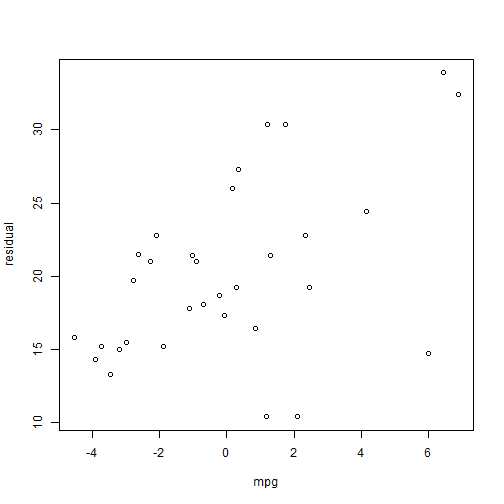

## Inputs

1. Application takes in a csv file as input

2. The file may or may not contain a header. It is preferable to have a header line

3. populates two lists - one for selecting depndent vars and the other for selecting independent vars

```r
in.1 <- mtcars
model <- lm(mpg ~ wt + am, data = in.1)
```

---

## Ouputs
===========================================================
1. Based on selection of radio buttons three outputs can be generated

2. When regression is selected a regression summary and plot of residuals is generated

```r
summary(model)
```

```
## 
## Call:
## lm(formula = mpg ~ wt + am, data = in.1)
## 
## Residuals:
##    Min     1Q Median     3Q    Max 
## -4.530 -2.362 -0.132  1.403  6.878 
## 
## Coefficients:
##             Estimate Std. Error t value Pr(>|t|)    
## (Intercept)  37.3216     3.0546   12.22  5.8e-13 ***
## wt           -5.3528     0.7882   -6.79  1.9e-07 ***
## am           -0.0236     1.5456   -0.02     0.99    
## ---
## Signif. codes:  0 '***' 0.001 '**' 0.01 '*' 0.05 '.' 0.1 ' ' 1 
## 
## Residual standard error: 3.1 on 29 degrees of freedom
## Multiple R-squared: 0.753,	Adjusted R-squared: 0.736 
## F-statistic: 44.2 on 2 and 29 DF,  p-value: 1.58e-09
```

---

## Slide 5
Sample Output
============================================================

```r
plot(resid(model), in.1$mpg, ylab = "residual", xlab = "mpg")
```

 


